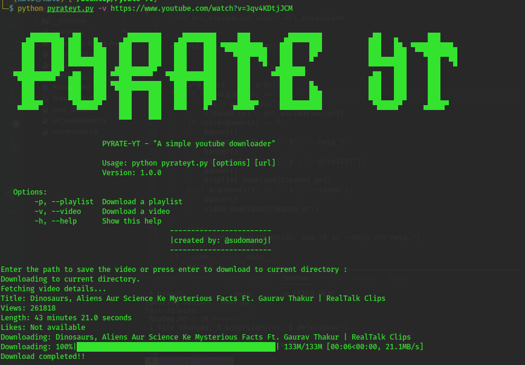

# Pyrate-YT

A simple Youtube download project which can download a single video or multiple videos within the playlist.


## Authors

- [@sudomanoj](https://www.github.com/sudomanoj)

## Run Locally

Clone the project

```bash
  git clone https://github.com/sudomanoj/Pyrate-YT.git
```

Go to the project directory

```bash
  cd Pyrate-YT
```

Install dependencies

```bash
  pip install -r requirements.txt
```

Run Code 

```bash
  python pyrateyt.py -h
```
Code Interface

